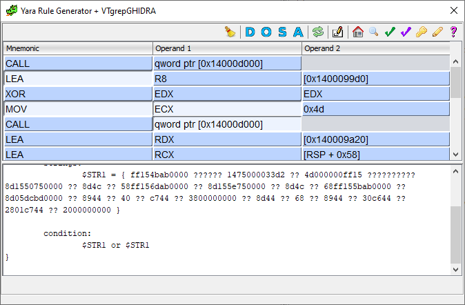
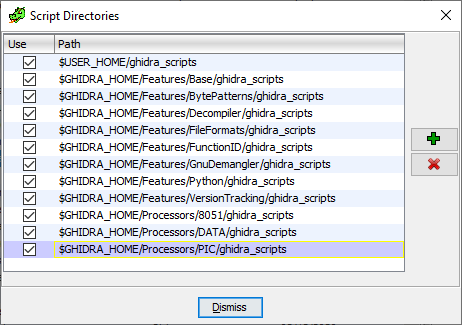
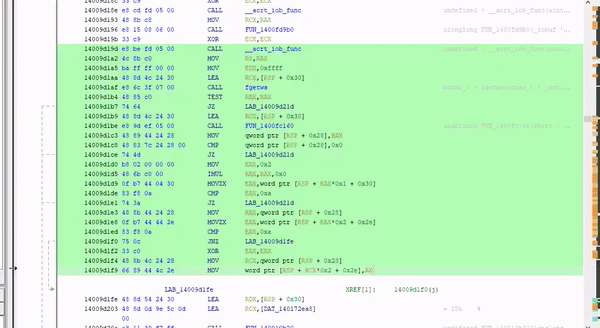
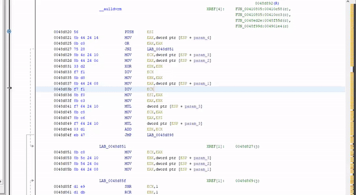

# ``vtgrepghidra`` - VT-GHIDRA Plugin

This is a non official VirusTotal plugin for GHIDRA. This plugin integrates functionality from VirusTotal web services into the GHIDRA's user interface.
The current version is v0.1, This plugin is not production-ready yet, and unexpected behavior can still occur and released without any warranty. This release integrates VTGrep into GHIDRA, facilitating the searching for similar code, strings, or sequences of bytes.

## Requirements

No special requirements are required for this plugin, currently search by certificate is supported on Windows only.

## Installation
Place the script files in any of the ``Script Directories`` (Window->Script Manager or via the shortcut: ):

and then click `Refresh script list`.

## Features
- *Search for bytes*: it searches for the bytes contained in the selected area "AS IS".
- *Search for similar code*: identifies memory offsets or addresses in the currently selected area and ignores them when searching.
- *Search for similar code (strict)*: same as above but it also ignores all the constants in the currently selected area.
- *Search for same signer*: searches for files signed by the same certificate to sign the loaded file.
- *Search for ImpHash*: searches for files with the same import hash.
- *Search similar-to*: searches for files using "similar-to" attribute by VT.
- *Customizations*: a comfortable GUI allows you to customize the query by masking/unmasking opcodes and operands before querying VT.

## Examples

General usage:

Searching by the same certificate:

## Credits
* This open-source project is backed by [SentinelOne](https://www.sentinelone.com/blog/)
* This plugin is based on GHIDRA's YARA search plugin GUI.
